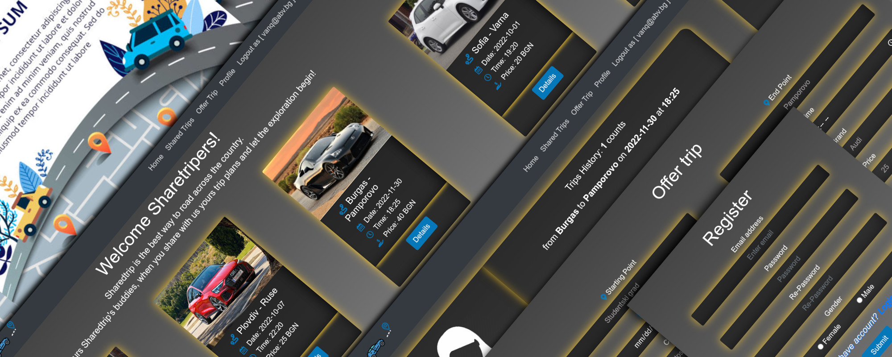

# shared-trip-express

Trip booking app,
built with Express, it use handlebars for templating engine and mongoDB for database which is used locally. Also using Mongoose to simplify the work with database.

Some extra tools:JWT and cookie-parser for session, bcrypt for hashing,express-validator.

You can changes config setings at /config/index.js or just use .evn.
